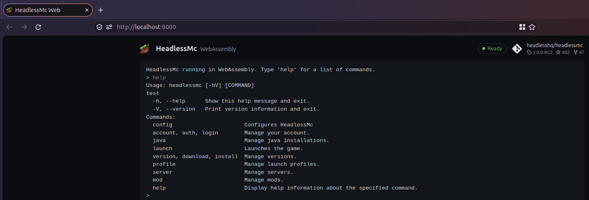

# headlessmc-web

> [!WARNING]
> Just an experiment, this does not have full support for installing/launchin Mc yet.

HeadlessMc compiled to WebAssembly with the experimental
[GraalVM Web Image](https://www.graalvm.org/latest/reference-manual/web-image/) backend
(`native-image --tool:svm-wasm`), plus a small website with a terminal to run it in the browser.

```shell
export GRAALVM_HOME=/path/to/oracle-graalvm-25.4   # Web Image is only in Oracle GraalVM 25.1+, not CE
export PATH=/path/to/binaryen/bin:$PATH            # wasm-opt, binaryen 119+
./scripts/build-web.sh
python3 -m http.server -d build/web 8000
```


